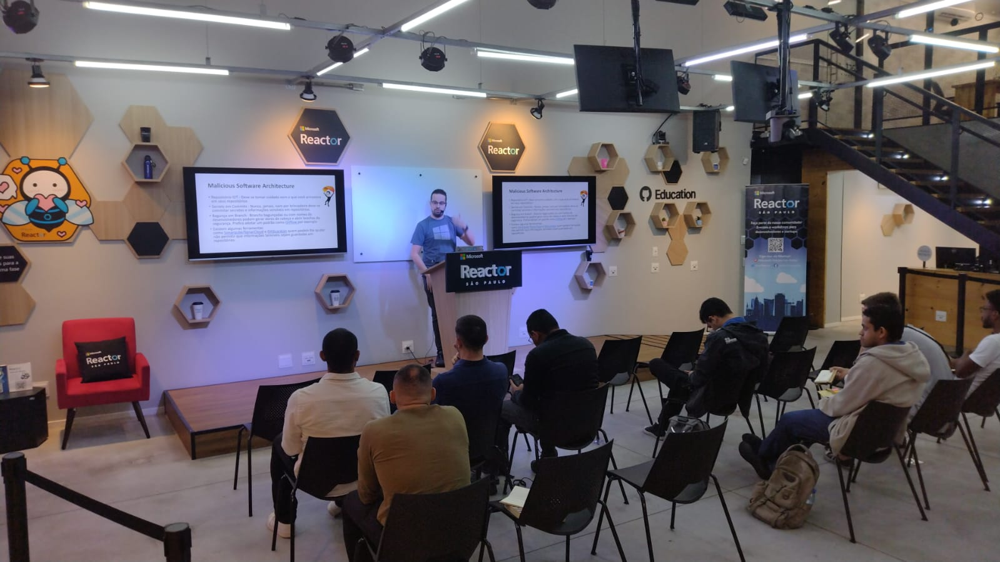

# .NET Conf 2024 - Azure Talks
Fotos e informações gerais sobre o evento ".NET Conf 2024 - Azure Talks - Containers, Segurança e muito mais!", realizado em 16/02/2024 na cidade de São Paulo-SP.

Organizadores:
- **Renato Groffe (Microsoft MVP, MTAC)**
- **Thiago Bertuzzi (Microsoft MVP)**

Número de participantes: **8 pessoas**

Apresentações/talks que aconteceram durante o evento:
* **Novidades no Desenvolvimento de Aplicações Containerizadas com .NET 8 e o Microsoft Azure - Renato Groffe (Microsoft MVP, MTAC)**

* **Desenvolvendo Aplicações Seguras na Nuvem com .NET 8 - Thiago Bertuzzi (Microsoft MVP)**

Tecnologias e tópicos abordados: **Azure Container Apps, Azure App Service, Kubernetes, Azure Kubernetes Service .NET 8, ASP.NET Core, C# 12, JWT, Azure AD B2C, Microsoft Entra ID, OWASP**

Acesse este [**link**](/img/) para visualizar todas as fotos das apresentações.

Este evento foi uma parceria entre a comunidade [**.NET SP**](https://www.meetup.com/dotnet-Sao-Paulo/) e o [**Microsoft Reactor**](https://www.meetup.com/Microsoft-Reactor-Sao-Paulo/).

Formulário utilizado para inscrições: [**Microsoft Reactor**](https://developer.microsoft.com/pt-br/reactor/events/21533/?wt.mc_id=1reg_21533_webpage_reactor)

Local: Microsoft Reactor - Rua Jaceru, 225 - Vila Gertrudes - São Paulo - SP - CEP: 04705-000

Deixamos aqui nossos agradecimentos ao Victor Temple e à Larissa Cyganski pela oportunidade e todo o apoio para promovermos esta edição local do .NET Conf no Microsoft Reactor em São Paulo-SP.

---

